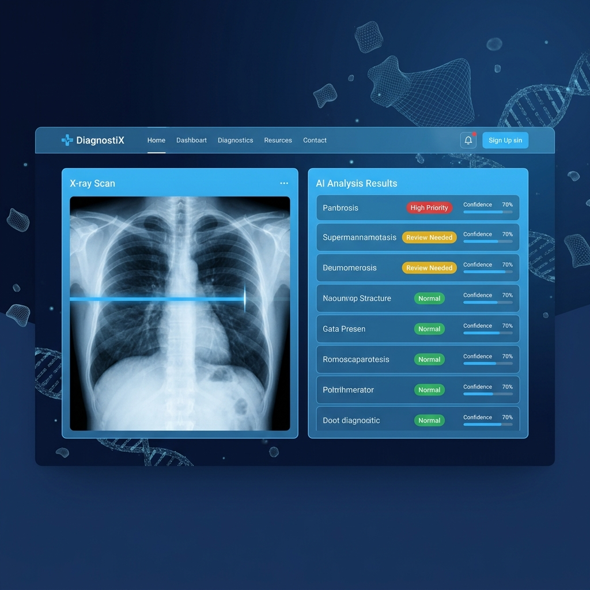
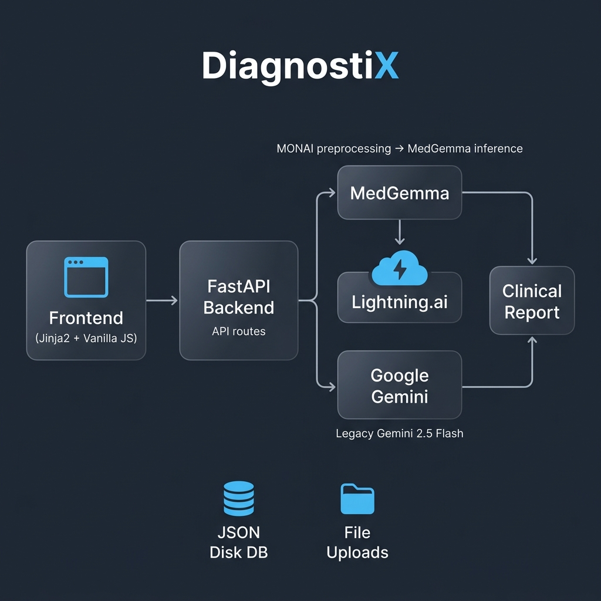

<p align="center">
  
</p>

<h1 align="center">DiagnostiX</h1>
<p align="center">
  <strong>AI-Powered Medical Imaging Diagnostics Platform</strong>
</p>
<p align="center">
  Upload a medical scan → Get instant AI findings → Receive a clinical report
</p>

<p align="center">
  
  
  
  
  
  
</p>

---



## ✨ What is DiagnostiX?

DiagnostiX is a full-stack medical diagnostics platform that analyzes X-Rays, MRIs, and CT scans using a **dual AI pipeline** — combining Google's **MedGemma** (for clinical-grade inference) with **Gemini 2.5 Flash** (as an intelligent fallback). Results are delivered through a premium glassmorphism UI with real-time scanning animations and interactive bounding-box overlays.

> **⚠️ Disclaimer:** This is a research/hackathon project. It is **not** a certified medical device and should **never** replace professional clinical judgment.

---

## 🏗️ Architecture



### How It Works (3-Step Pipeline)

| Step | Engine | What Happens |
|------|--------|-------------|
| **1. Upload** | FastAPI | Scan saved, patient metadata captured, unique `scan_id` assigned |
| **2. Detect** | MedGemma (primary) / Gemini (fallback) | Abnormalities identified with localized bounding boxes + confidence scores |
| **3. Report** | Same engine | Detected findings expanded into a structured clinical narrative |

### Dual AI Engine — Automatic Failover

```
Medical Scan
     │
     ▼
┌──────────────────────┐
│   Lightning.ai        │  ← Primary
│   MONAI → MedGemma   │
└──────────┬───────────┘
           │ success? ──→ Return findings
           │ fail?
           ▼
┌──────────────────────┐
│   Google Gemini       │  ← Fallback
│   2.5 Flash           │
└──────────┬───────────┘
           │
           ▼
      Clinical Report
```

---

## 🛠️ Tech Stack

| Layer | Technology |
|-------|-----------|
| **Backend** | Python · FastAPI · Uvicorn |
| **Primary AI** | MedGemma via Lightning.ai (MONAI preprocessing) |
| **Fallback AI** | Google Gemini 2.5 Flash (structured JSON output) |
| **Frontend** | Jinja2 templates · Vanilla JS · CSS Glassmorphism |
| **Storage** | JSON file DB · Local file uploads |

---

## 🚀 Quick Start

### Prerequisites

- Python 3.10+
- A [Google AI Studio](https://aistudio.google.com/apikey) API key (for Gemini)
- *(Optional)* A [Lightning.ai](https://lightning.ai) studio running MedGemma

### Setup

```bash
# 1. Clone the repo
git clone https://github.com/YOUR_USERNAME/DiagnostiX.git
cd DiagnostiX

# 2. Create & activate a virtual environment
python -m venv .venv
.venv\Scripts\activate        # Windows
# source .venv/bin/activate   # macOS/Linux

# 3. Install dependencies
pip install -r requirements.txt

# 4. Configure API keys
cp backend/.env.example backend/.env
# Open backend/.env and paste your keys

# 5. Run the server
python -m backend.main
```

Open **http://127.0.0.1:8000** and upload a scan!

---

## 📁 Project Structure

```
DiagnostiX/
├── backend/
│   ├── main.py                 # FastAPI app — routes & API endpoints
│   ├── medical_ai_service.py   # Primary AI engine (MedGemma / Lightning.ai)
│   ├── ai_service.py           # Legacy fallback engine (Gemini 2.5 Flash)
│   ├── .env.example            # Template for API keys
│   └── uploads/                # Uploaded scan files (git-ignored)
├── frontend/
│   ├── templates/              # Jinja2 HTML templates
│   │   ├── base.html           # Shared layout + nav
│   │   ├── index.html          # Upload page
│   │   ├── diagnostics.html    # AI scanning & results
│   │   └── report.html         # Full clinical report
│   └── static/
│       ├── css/                # Glassmorphism design system
│       ├── js/                 # Interactive components
│       └── img/                # Branding assets
├── scripts/
│   ├── generate_test_scan.py   # Create a dummy NIfTI test file
│   └── test_lightning_api.py   # Lightning.ai endpoint tester
├── docs/images/                # README visuals
├── requirements.txt
└── .gitignore
```

---

## 🔑 Environment Variables

Create `backend/.env` using [`backend/.env.example`](backend/.env.example) as a template:

| Variable | Required | Description |
|----------|----------|-------------|
| `GEMINI_API_KEY_1` | ✅ | Gemini key for the Detection Engine |
| `GEMINI_API_KEY_2` | ✅ | Gemini key for the Explanation Engine |
| `LIGHTNING_API_URL` | ❌ | MedGemma endpoint URL (falls back to Gemini if unavailable) |
| `LIGHTNING_TIMEOUT` | ❌ | Request timeout in seconds (default: `120`) |

---

## 🤝 Contributing

1. Fork the repository
2. Create a feature branch (`git checkout -b feat/my-feature`)
3. Commit your changes (`git commit -m 'Add my feature'`)
4. Push to the branch (`git push origin feat/my-feature`)
5. Open a Pull Request

---

<p align="center">
  Built with ❤️ for <strong>HACK-O-NIT 2026 AI Summit</strong>
</p>
